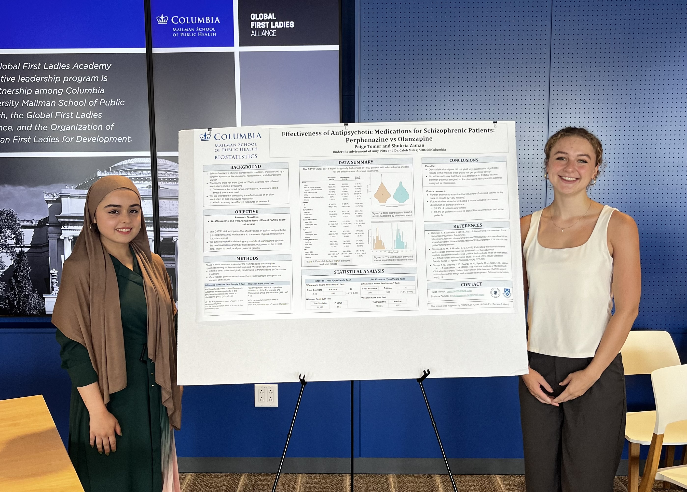

**Mentor:** Caleb Miles, PhD, Assistant Professor of Biostatistics  
**Mentees:** Shukria Zaman and Paige Tomer

Using data from the Clinical Antipsychotic Trials of Intervention Effectiveness (CATIE), we compared the effectiveness of newer antipsychotic medications relative to older medications in their effect on health outcomes in patients with schizophrenia.

We considered different approaches to adjusting for noncompliance, since the study design allowed patients to change their medication over the course of the study. We also looked at treatment effect heterogeneity to understand whether some patients would do better on one medication and other patients on another, or whether the strength of the effect varied depending on certain patient characteristics.

