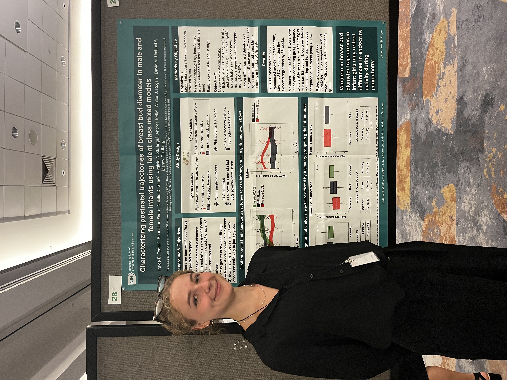

This was my primary project during my research fellowship at the _National Institute of Environmental Health Sciences_, where I worked on Dr. Mandy Goldberg's Puberty and Cancer Epidemiology group. For this research, we examined postnatal trajectories of breast bud diameter in female and male infants using latent class linear mixed models (LCMMs). The work grew out of an interest in minipuberty, a period of transient postnatal endocrine activity, and in how longitudinal methods can help identify distinct developmental patterns that may be hidden in population averages.

Using data from the Infant Feeding and Early Development Study, we modeled ultrasound-based breast bud diameter over time separately by sex in order to characterize whether infants followed different growth patterns during early life.

## Methods

- Applied sex-specific latent class linear mixed models to repeated ultrasound measures
- Modeled age flexibly using spline-based trajectories
- Compared candidate models using fit criteria, entropy, and class size considerations
- Explored how identified groups differed by participant characteristics and hormone patterns

## Key findings

- In females, the best-fitting model identified three trajectory groups: decreasing, stable, and increasing
- In males, the best-fitting model identified two trajectory groups: decreasing and stable
- Among females, trajectory groups differed in gestational age, birth weight measures, and some summaries of estradiol and testosterone
- Among males, gestational age differed by trajectory group, while hormone summaries were less clearly separated

## Paper 

The paper is forthcoming and will be linked here when accesible.

## Personal + practical importance

This project was exciting because it combined longitudinal modeling with a developmental health question in an area where little is known. Rather than assuming all infants follow the same pattern, the LCMM approach made it possible to describe heterogeneity in breast tissue trajectories and generate more focused questions for future research. I also got the amazing opporunity to present this work at the National Institutes of Health in Bethesda, and the annual meetings for the Society of Epidemiological Research and the Society of Perinatal and Pediatric Epidemiological Research. 

Below is a picture of me at SER and the NIH main campus!

  
  

